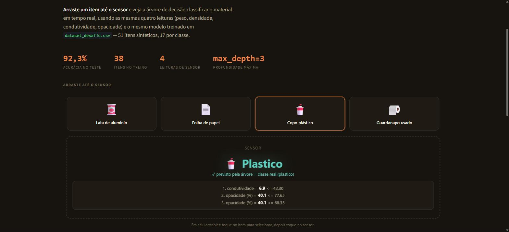

<div align="center">

# Sensor de Triagem de Resíduos

**Arraste um item até o sensor. A árvore de decisão identifica o material em tempo real.**

Uma árvore de decisão que classifica resíduos em papel, plástico ou metal a
partir de quatro leituras de sensor, com uma zona de arrastar e soltar que
mostra a classificação e o caminho percorrido instantaneamente.

[](https://www.python.org)
[](https://scikit-learn.org)
[](https://streamlit.io)
[](LICENSE)

**Português** &nbsp;·&nbsp; [English](README.en.md)

</div>



---

## O problema

Este é o desafio autoral da Aula 3 (LCML): criar um dataset de classificação
próprio e treinar uma árvore de decisão sobre ele. O domínio escolhido foi um
sensor de esteira de triagem de recicláveis, que precisa separar papel,
plástico e metal antes do descarte, reduzindo a contaminação de lotes
reciclados por material misturado.

> Treinamos um modelo de **classificação multiclasse** que recebe **quatro
> leituras numéricas de sensor** (peso, densidade, condutividade elétrica,
> opacidade visual) e produz **o material do resíduo**: papel, plástico ou
> metal.

| | |
|---|---|
| **Tipo de tarefa** | Classificação multiclasse (3 classes) |
| **Entrada `X`** | Peso (g), densidade (g/cm³), condutividade (0 a 100), opacidade (%) |
| **Saída `y`** | Uma entre `papel`, `plastico`, `metal` |
| **Unidade de análise** | Um item de resíduo |
| **Métrica** | Acurácia em conjunto de teste + impureza de Gini na folha |
| **Erro mais grave** | Prever metal ou plástico como papel (contaminação do lote reciclável) |

---

## Como rodar

```bash
git clone https://github.com/caiogadotti/sensor-triagem-desafio.git
cd sensor-triagem-desafio
pip install -r requirements.txt
streamlit run app.py
```

O app abre em `http://localhost:8501`. O dataset (`dataset_desafio.csv`)
já vem no repositório, então não é preciso gerar nada antes de rodar.

---

## O que o app faz

**Arraste e solte.** Quatro itens (lata de alumínio, folha de papel, copo
plástico, guardanapo usado) podem ser arrastados até a zona do sensor, ou
selecionados por toque em telas sensíveis ao toque. A classificação roda
instantaneamente, replicando a mesma árvore treinada em Python: a leitura
real de cada item (peso, densidade, condutividade, opacidade) é comparada
contra os limites exatos que a árvore aprendeu.

**Mostrar o raciocínio, não só a resposta.** Depois de soltar um item, o app
lista cada pergunta que a árvore fez, na ordem em que foi feita, junto com a
confirmação (ou não) de que a previsão bate com o material real do item. Um
dos quatro itens (o guardanapo) fica perto do limite de opacidade, para
mostrar um caso de fronteira.

**Modo manual.** Abaixo da zona de arrastar, quatro sliders (um por leitura
de sensor) permitem testar qualquer combinação de valores, com as
probabilidades das três classes e o caminho de decisão completo, no mesmo
formato do projeto da Aula 3 com o dataset Iris.

**A árvore inteira, sob demanda.** Uma seção expansível desenha a árvore
completa (`plot_tree`) e imprime as mesmas regras em texto
(`export_text`).

**Por que `max_depth=3`.** Outra seção reproduz o experimento do notebook:
treinar a árvore em seis profundidades diferentes e comparar acurácia de
treino contra teste.

---

## O dataset

`dataset_desafio.csv`: 51 itens sintéticos (17 por classe), gerados por
script próprio (`numpy.random.default_rng(42)`), com distribuição normal por
atributo e por classe, parametrizada com faixas físicas plausíveis (ex.:
metal com condutividade e densidade muito mais altas que papel e plástico) e
sobreposição proposital entre papel e plástico, para a árvore não aprender
uma regra trivial demais.

## O modelo

**`DecisionTreeClassifier(max_depth=3, random_state=42)`**, treinado em 75%
dos 51 itens (38 exemplos), com separação estratificada.

### Regra aprendida

```
condutividade <= 42.30
├── opacidade_pct <= 77.65
│   ├── opacidade_pct <= 68.35 → plastico
│   └── opacidade_pct >  68.35 → papel
└── opacidade_pct >  77.65 → papel
condutividade >  42.30 → metal
```

Em português: se a condutividade for alta, é metal. Senão, se a opacidade
for baixa, é plástico; se for alta, é papel. Acurácia de treino: 97,4%.
Acurácia de teste: 92,3% (12 de 13 exemplos corretos).

---

## Projeto e estrutura

```
├── app.py                    interface Streamlit (arrastar e soltar + modo manual)
├── src/
│   ├── dataset.py             carrega dataset_desafio.csv e separa treino/teste
│   ├── model.py                treina a arvore e compara profundidades
│   └── explicacao.py           traduz o caminho da arvore em regras legiveis
├── dataset_desafio.csv
├── requirements.txt
└── docs/
```

---

## Stack

| Biblioteca | Papel |
|---|---|
| **scikit-learn** | `DecisionTreeClassifier`, `train_test_split`, `plot_tree`, `export_text` |
| **pandas** | Carregamento do dataset como tabela |
| **NumPy** | Leitura da estrutura interna da árvore |
| **Matplotlib** | Desenho da árvore completa dentro do app |
| **Streamlit** | Interface web, incluindo o componente HTML/JS de arrastar e soltar |

---

## Créditos e licença

**Disciplina:** Laboratório Computacional de Aprendizado de Máquina (LCML), 2026/2
**Turma:** CIB-NA8
**Professor:** Reinaldo Augusto de Oliveira Ramos

**Dados:** dataset autoral, gerado sinteticamente para o desafio da Aula 3.

Código sob licença [MIT](LICENSE).
